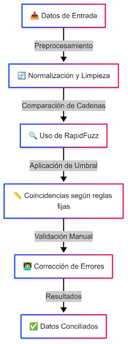

## Documentación Técnica 
Solución de Conciliación de Datos enfoque Iterativo con RapidFuzz y Ajuste Dinámico
### 1. Resumen Ejecutivo
La solución desarrollada tiene como objetivo conciliar dos conjuntos de datos provenientes de fuentes distintas, garantizando que, a pesar de diferencias en la forma de registrar información (por ejemplo, errores tipográficos, variaciones en fechas o importes), se puedan identificar de forma precisa y auditable las transacciones equivalentes. Para ello, se implementó un proceso iterativo que combina técnicas de matching exacto y difuso, validación de discrepancias y ajuste dinámico de umbrales inspirado en conceptos de machine learning.

### 2. Introducción
En entornos financieros y transaccionales, es común disponer de datos provenientes de diversas fuentes con ligeras variaciones en la forma en que se registran. La conciliación de estos datos es crítica para garantizar la integridad y confiabilidad de la información. Esta solución automatiza dicho proceso, permitiendo además auditar y reportar cada paso del proceso.

### 3. Objetivos de la Solución
Identificar coincidencias: Encontrar registros equivalentes en ambas fuentes, tanto mediante coincidencias exactas como mediante técnicas de matching difuso.
Validar y ajustar discrepancias: Verificar y ajustar diferencias en importes y fechas, aplicando técnicas de segregación cuando sea necesario.
Trazabilidad y auditoría: Registrar resultados intermedios y generar reportes completos que incluyan indicadores estadísticos y visualizaciones, proporcionando seguridad en el proceso.
Ajuste dinámico: Adaptar umbrales y pesos de los campos en función del desempeño del matching a lo largo de iteraciones.

### 4. Descripción del Problema
Existen dos tablas (tabla1 y tabla2) con información transaccional que, a pesar de contener campos similares, pueden presentar diferencias en:

- Textos: Variaciones en la forma en que se registran nombres, descripciones u otros campos de texto.
- Fechas: Diferencias en el formato o en la exactitud de las fechas.
- Importes: Pequeñas discrepancias en los montos registrados.

El reto consiste en conciliar estos registros de forma automática, considerando tolerancias en las diferencias y ajustando montos cuando sea necesario.

### 5. Arquitectura de la Solución
La solución se estructura en un único script modularizado en Python, que se puede ejecutar en un entorno controlado (por ejemplo, un Notebook en Visual Studio Code o un script de línea de comandos). La pieza central es la clase ConciliadorAvanzado, que encapsula toda la lógica de conciliación, validación y reporte.

El proceso se divide en los siguientes bloques:

- Carga y preparación de datos: Lectura de archivos Excel y normalización de la información.
#### Matching:
- Matching exacto: Utilizando claves compuestas para identificar coincidencias claras.
- Matching difuso: Empleando técnicas de comparación de cadenas para identificar coincidencias cercanas.
-  Validación y ajuste: Comparación de importes y fechas, y aplicación de segregación de registros en caso de discrepancias.
- Ajuste dinámico: Actualización de umbrales y pesos de campos en función de la efectividad del matching.
- Auditoría y reporte: Registro de resultados intermedios y generación de reportes con indicadores y visualizaciones.

### 6. Tecnologías Utilizadas y Justificación
#### Python y Pandas:

Se utiliza Python por su versatilidad y capacidad para manejar grandes volúmenes de datos. La biblioteca pandas es esencial para la manipulación, transformación y análisis de datos estructurados.

#### RapidFuzz:

Esta librería permite realizar comparaciones "fuzzy" (difusas) de forma rápida y eficiente, ideal para detectar coincidencias en textos con errores tipográficos o variaciones.

#### Concurrent.futures (ThreadPoolExecutor):
Para mejorar el rendimiento y procesar grandes volúmenes de datos en paralelo, se implementa la paralelización de tareas.

#### XlsxWriter:
Se utiliza para generar reportes en formato Excel que incluyan múltiples hojas, tablas y gráficos, facilitando la interpretación de los resultados.

#### Conceptos de Machine Learning (ML):
Aunque no se implementa un modelo ML completo, se adoptan principios de aprendizaje (ajuste dinámico de umbrales y pesos) para que el sistema se optimice a medida que avanza en las iteraciones.

### 7. Descripción del Proceso de Conciliación
#### 7.1 Extracción y Preparación de Datos
- Carga:
Se leen los archivos Excel de tabla1 y tabla2 usando pandas, especificando el tipo de dato para columnas clave.
- Normalización:
Se procesan los textos para convertirlos a minúsculas, eliminar caracteres especiales y generar una "clave compuesta" que agrupa campos relevantes.

#### 7.2 Matching
- Matching Exacto:
Se realiza un merge directo entre ambas tablas basado en la clave compuesta. Los registros coincidentes se marcan como "conciliados" y se les asigna un puntaje de 100.
- Matching Difuso:
Se utiliza RapidFuzz para comparar las cadenas de texto de forma difusa. Se paraleliza el proceso con ThreadPoolExecutor para mejorar la eficiencia.

#### 7.3 Validación y Ajuste
- Comparación de Importes y Fechas:
Se validan las diferencias de montos e importes entre registros coincidentes. Se establecen umbrales de tolerancia para determinar si las diferencias son aceptables.
- Segregación de Registros:
En caso de discrepancias significativas, se realiza una segregación para ajustar los importes. Cada registro segregado se cuenta y se registra para auditoría.

#### 7.4 Ajuste Dinámico
- Optimización Iterativa:
El proceso se repite en varias iteraciones. En cada ciclo, se ajustan los umbrales y pesos de los campos en función de la efectividad observada, permitiendo que el sistema se "auto-optimice".
#### 7.5 Auditoría y Reporte
- Resultados Intermedios:
Cada iteración guarda los resultados en archivos CSV en la carpeta "Resultados", permitiendo la auditoría del proceso.
- Reporte Final:
- - 	Se genera un archivo Excel que incluye:
- -  	Hojas con los registros finales de cada tabla.
- - 	Un resumen estadístico con indicadores clave (totales, matches exactos/difusos, puntajes, iteraciones, segregaciones, etc.).
- - 	Visualizaciones como gráficos de la distribución de puntajes.
#### 8. Estructura del Código y Funcionalidades Principales
La clase ConciliadorAvanzado es el núcleo de la solución e incluye los siguientes métodos:

- cargar_datos: Carga y prepara los datos de entrada.
- generar_clave_compuesta: Combina campos relevantes para crear una clave que sirva de base para el matching.
- _match_semilla: Realiza el matching exacto entre las tablas.
- matching_inteligente: Ejecuta el matching difuso utilizando RapidFuzz.
- _validar_matches: Compara importes y fechas, y valida los registros coincidentes.
- segregar_registro: Ajusta montos y realiza la segregación en casos de discrepancias, incrementando un contador.
- _actualizar_pesos_campos: Ajusta dinámicamente los pesos de cada campo basado en la efectividad del matching.
- generar_reporte: Crea un reporte en Excel con indicadores y gráficos.
- validacion_cruzada: Permite generar una muestra de registros para validación manual.

#### 9. Flujo de Trabajo e Iteraciones
El proceso se ejecuta de forma iterativa:
-	Se inician las iteraciones de conciliación.
-	En cada iteración se ejecutan los pasos de matching (exacto y difuso), validación, segregación y ajuste de pesos.
-	Los resultados intermedios se guardan para auditoría.
-	El proceso se detiene cuando se alcanza un criterio de salida (por ejemplo, cuando el número de registros conciliados cae por debajo de un umbral mínimo).

#### 10. Resultados y Reportes Generados
El reporte final se genera en formato Excel e incluye:
-	Hojas con datos finales: Registro conciliado de ambas tablas.
-	Resumen estadístico: Total de registros, matches exactos, difusos, registros sin match, promedio y mediana de puntajes, iteraciones completadas, fase final, umbrales utilizados y número de segregaciones.
-	Visualizaciones: Gráfico de la distribución de puntajes de matching que facilita la interpretación de la calidad del proceso.
#### 11. Buenas Prácticas y Recomendaciones
Auditoría: Se guardan resultados intermedios para poder realizar análisis retrospectivo en caso de inconsistencias.
Escalabilidad: La utilización de paralelización y técnicas de matching difuso permiten procesar grandes volúmenes de datos en tiempos razonables.
Trazabilidad: La inclusión de indicadores y visualizaciones en los reportes aumenta la transparencia y permite una validación por parte de todas las áreas implicadas.
#### 12. Conclusiones
La solución de conciliación de datos presentada es robusta y adaptable. Emplea tecnologías probadas en el mundo del análisis de datos y se beneficia de técnicas inspiradas en machine learning para mejorar su desempeño iterativo. La generación de reportes detallados y la persistencia de resultados intermedios garantizan una completa trazabilidad, lo que permite a la empresa contar con una herramienta confiable para la conciliación de datos transaccionales.

#### 13. Futuras Mejoras
Integración de modelos ML: Se puede explorar la incorporación de modelos de machine learning supervisados para mejorar aún más el matching, basados en ejemplos históricos.
Optimización en tiempo real: Implementar un dashboard interactivo que muestre en tiempo real el avance y calidad de la conciliación.
Refinamiento de reglas: Ajustar y afinar las reglas de validación y segregación en base a retroalimentación continua.
